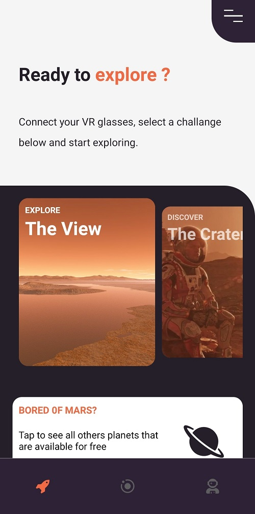
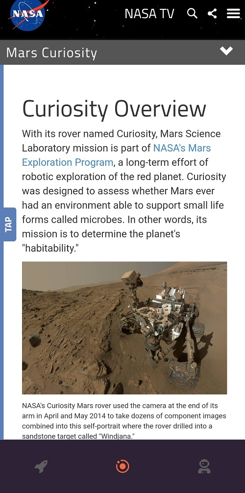

# MarsExplore
A app for you explore mars and the universe

# Before explore, lets go install all dependencies :)

First, this is a mobile app. access the links below make the installations according to the recommendations and ready.

Expo
1ª https://expo.io/

Node
2º https://nodejs.org/en/

Expo Client
3º https://play.google.com/store/apps/details?id=host.exp.exponent

Good exploring!
